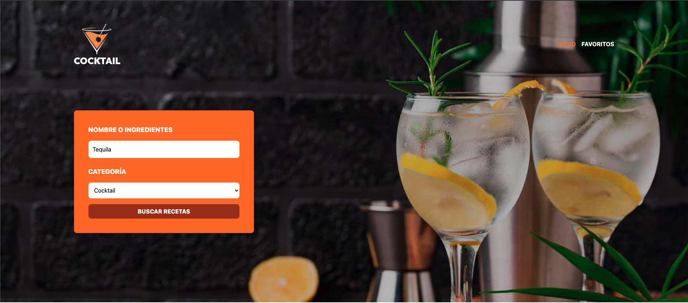
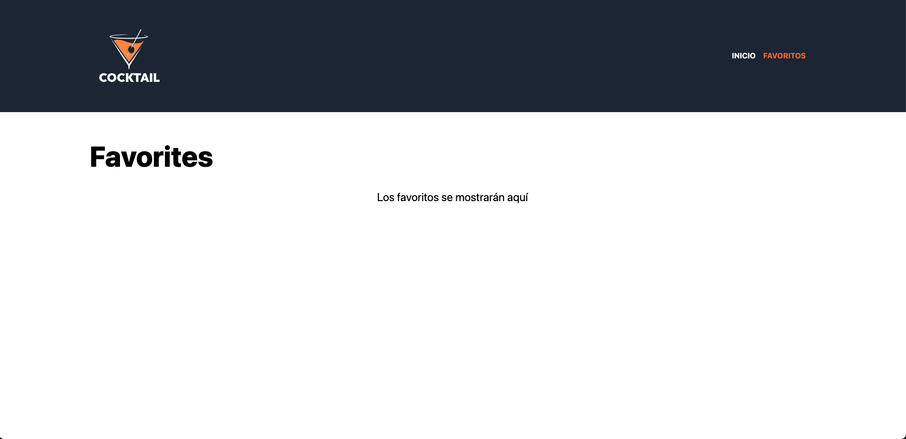
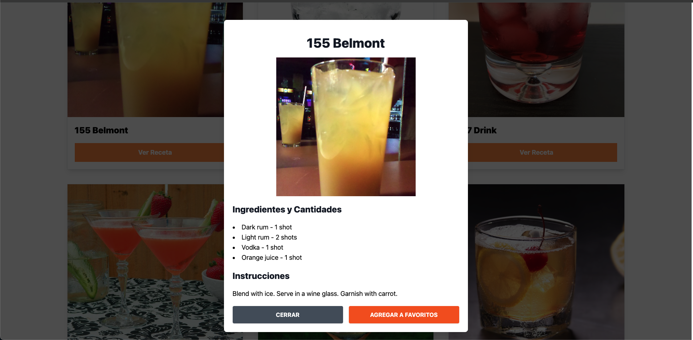

# App web Busqueda de bebidas

Proyecto de app web para la búsqueda de bebidas. En el caso de encontrar la búsqueda, se listará la información de la receta encontrada, y al seleccionar un ítem (bebida), se despliega una modal con el detalle de la información y poder presionar el botón favorito, y se mostrará el ítem seleccionado en la pantalla favoritos y se agregó una pantalla para poder generar recetas por IA.

## Pila de tecnología

-  react 18.2.0
-  react-dom 18.2.0
-  vite 5.2.0
-  zod
-  typescript 5.0.2
-  axios
-  zustand
-  tailwindcss
-  @openrouter/ai-sdk-provider
-  react-router-dom
-  @headlessui/react
-  @heroicons/react 

##  Pantalla de App Web Buscador de bebidas

1.- Formulario de buscador de bebidas
&nbsp;

 

2.- Listado del resultado de la busqueda de la bebida
&nbsp;

 

3.- Listado en la pagina favoritos
&nbsp;

 

4.- Detalle bebida seleccionada

 

5.- Pantalla para generar recetas por ia

 

